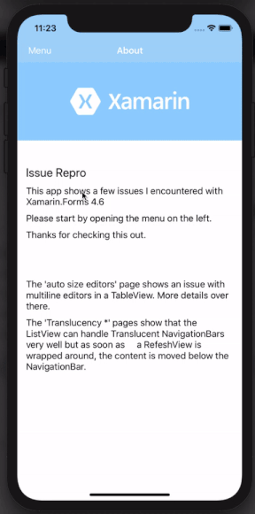

## Xamarin is awesome, MAUI is going to rock 🤘
Unfortunately, I have two issues to work around.
- Multiline editors are not resizing in `AutoSize=TextChanges` while the text changes.
- if a [NavigationBar is set to be Translucent](https://xamgirl.com/transparent-navigation-bar-in-xamarin-forms/), the views are moved below the NavigationBar. One exception is the ListView which works perfectly - as long as no RefreshView is used. If the ListView is packed into a RefreshView to use Pull-To-Refresh, the views are moved below the NavigationBar as well.

